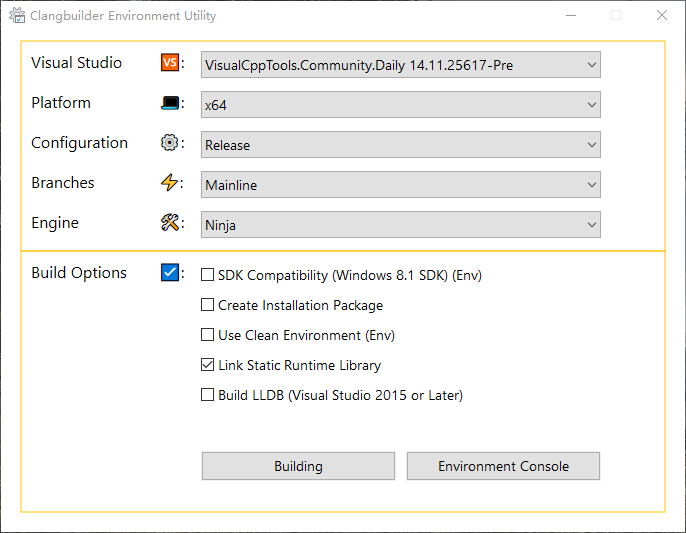

# Clangbuilder

Automated tools help developers on Windows platforms building LLVM and clang.
 

## Installation

### PowerShell Policy

Often you need to change the Power Shell execution policy

```powershell
Get-ExecutionPolicy
```

**Output**:

> Restricted

Please run PowerShell with administrator rights, and Enter:   

```powershell
Set-ExecutionPolicy RemoteSigned
```

### General Setup

Clone clangbuilder on Github

```shell
git clone https://github.com/fstudio/clangbuilder.git clangbuilder
```

Click the `script/InitializeEnv.bat`

The installation script will compile ClangbuilderUI and create a shortcut, download required packages.

If your need install `VisualCppTools.Community.Daily` ,click `script/VisualCppToolsFetch.bat`


## Build Clang on Windows

Clangbuilder Now Only support use Visual C++ build Clang LLVM LLDB. 

Best Visual Studio Version:

>VisualStudio 2017

You can run ClangbuilderUI, select Arch, Configuration and other options. after click `Building`

**ClangbuilderUI Snapshot**


**Update 2017-08-19** Clangbuilder support **VisualCppTools.Community.Daily**:



**VisualCppTools.Community.Daily** current not support msbuild (becasue cmake ...)

**Branch**

+  Mainline, master/trunk branch , git fetch from https://github.com/llvm-mirror/
+  Stable, llvm stable branch, like release_50, git fetch from https://github.com/llvm-mirror/
+  Release, llvm release tag, download for https://releases.llvm.org/

**Engine**

+   MSbuild use msbuild build llvm
+   Ninja use ninja build llvm
+   NinjaBootstrap use ninja build and bootstrap llvm
+   NinjaIterate use ninja build llvm, but compile is prebuilt clang (config by `config\prebuilt.json`)

prebuilt.json:
```json
{
    "LLVM": {
        "Path": "D:/LLVM",
        "Arch": "x64"
    }
}
```

**Libc++**

Only NinjaBootstrap and NinjaIterate will compile libc++ ,Because Visual C++ not support `include_next` now.

**ARM64**

Build LLVM for ARM64 is broken, You can download **Enterprise WDK (EWDK) Insider Preview** from https://www.microsoft.com/en-us/software-download/windowsinsiderpreviewWDK ,When you config `config/ewdk.json`, ClangbuilderUI able to start `ARM64 Environment Console`

ewdk.json:
```json
{
	"Path":"D:\\EWDK",
	"Version":"10.0.16257.0"
}
```

## Commandline

```cmd
.\bin\clangbuilder
```

## Suggest

+   Best Platform is Windows 10 x64 
+   Select `Use Clean Environment` will reset current process Environment PATH value, Resolve conflict environment variables
+   If your will build lldb, your should install python3.

```powershell
$env:Path = "${env:windir};${env:windir}\System32;${env:windir}\System32\Wbem;${env:windir}\System32\WindowsPowerShell\v1.0"
```
`$evn:windir` is usually `C:\Windows`

## Environment Console

When you only need to start a console environment, you can click on the `Environment Console`。

## Add Portable Utilities

You can modify `config/packages.json`, 
and then double-click `script/UpdatePkgs.bat` to the software you need as part of the Clangbuilder is added to the environment


## Add Extranl Libs

You can add extranl lib, such as [z3](https://github.com/Z3Prover/z3) , more info to view ExternalLibs.md

## About Ninja Task

**If your memory is small, use ninja to build LLVM, and in the process of linking, the build process is slow due to memory contention. And the computer may even lose its response.**

Link clang requre 1.5GB memory，other require 0.8GB，and Ninja create N+ (processor default 6) link process, requre (0.8xN+0.7)GB or great memory  

## Copyright

Author: Force.Charlie  
Copyright © 2017 ForceStudio. All Rights Reserved.

